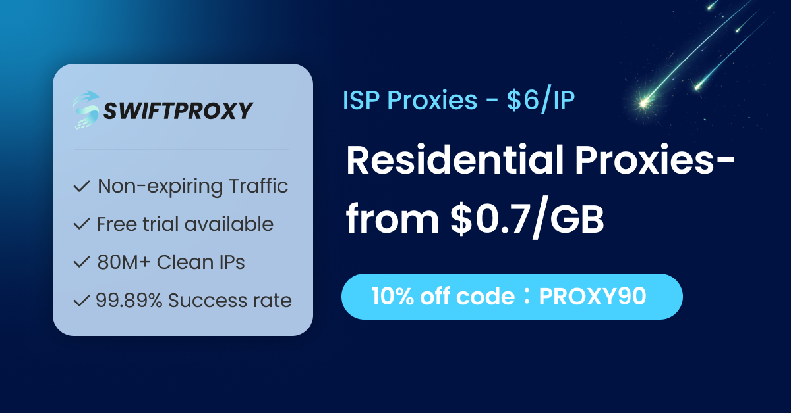

<p align="center">
  
  
  
  
</p>

<h1 align="center">Pydoll Antibot Bypasser</h1>

<p align="center">
  <b>Claude Code Plugin for Stealth Browser Automation & WAF Bypass</b>
</p>

<p align="center">
  <a href="#installation">Installation</a> &middot;
  <a href="#sponsor">Sponsor</a> &middot;
  <a href="#capabilities">Capabilities</a> &middot;
  <a href="#usage">Usage</a> &middot;
  <a href="#plugin-structure">Structure</a> &middot;
  <a href="#中文说明">中文说明</a>
</p>

---

## What is this?

A **Claude Code Plugin** that teaches Claude how to write stealth browser automation scripts using [Pydoll](https://github.com/autoscrape-labs/pydoll) — an async-native, zero-WebDriver Chromium automation library specialized in bypassing WAF protections and bot detection systems.

When you ask Claude Code to bypass Cloudflare, scrape a protected website, or automate a browser with anti-detection, this skill activates automatically.

---

## Installation

### Marketplace Install (Recommended)

This repository is a self-contained [plugin marketplace](https://code.claude.com/docs/en/plugin-marketplaces). Add it and install:

```bash
# Step 1: Register the marketplace
/plugin marketplace add esonhugh/pydoll-cf-waf-bypasser-skills

# Step 2: Install the plugin
/plugin install pydoll-antibot-bypasser@pydoll-cf-waf-bypasser-skills
```

### Install from GitHub

```bash
/plugin install github:Esonhugh/pydoll-cf-waf-bypasser-skills
```

### Manual Install

```bash
git clone https://github.com/Esonhugh/pydoll-cf-waf-bypasser-skills.git

# Project-level (current project only)
cp -r pydoll-cf-waf-bypasser-skills/plugins/pydoll-antibot-bypasser/skills/pydoll-antibot-bypasser \
      your-project/.claude/skills/

# Or global (all projects)
cp -r pydoll-cf-waf-bypasser-skills/plugins/pydoll-antibot-bypasser/skills/pydoll-antibot-bypasser \
      ~/.claude/skills/
```

### Team Configuration

Add to your project's `.claude/settings.json` so team members are auto-prompted to install:

```json
{
  "extraKnownMarketplaces": {
    "pydoll-cf-waf-bypasser-skills": {
      "source": {
        "source": "github",
        "repo": "Esonhugh/pydoll-cf-waf-bypasser-skills"
      }
    }
  },
  "enabledPlugins": {
    "pydoll-antibot-bypasser@pydoll-cf-waf-bypasser-skills": true
  }
}
```

---

## Sponsor

<p align="center">
  <a href="https://www.swiftproxy.net/?ref=Esonhugh">
    
  </a>
</p>

<p align="center">
  <a href="https://www.swiftproxy.net/?ref=Esonhugh">Swiftproxy</a> — Premium residential proxies with 80M+ IPs across 190+ countries. Supports HTTP, HTTPS, and SOCKS5 with rotating and sticky sessions, non-expiring traffic, and free trials. Built for Cloudflare bypass, web scraping, browser automation, and AI workflows. 10% OFF with code: <b>PROXY90</b>.
</p>

---

## Capabilities

| Capability | Description |
|:---|:---|
| **Cloudflare Turnstile** | Auto-detect and solve Turnstile CAPTCHA, works in headless mode |
| **Cloudflare Managed Challenge** | Bypass with `headless=False` + xvfb on servers |
| **Cloudflare JS Challenge** | Auto-execute JavaScript challenges |
| **Human-like Interaction** | Bezier curve mouse movement, typo simulation, random delays |
| **Shadow DOM Access** | Penetrate closed shadow roots for hidden elements |
| **Browser Fingerprint Spoofing** | Fake engagement time, WebRTC leak protection, language spoofing |
| **Concurrent Scraping** | Async-native, multi-tab parallel execution |
| **Request Interception** | Block images/CSS/fonts to accelerate page loading |

### WAF Support Matrix

| WAF Provider | Status | Notes |
|:---|:---:|:---|
| Cloudflare Turnstile | ✅ Full | Works in headless mode |
| Cloudflare JS Challenge | ✅ Full | Auto JS execution |
| Cloudflare Managed Challenge | ✅ Verified | Requires `headless=False` + xvfb |
| DataDome | ⚠️ Partial | Needs high-quality proxy |
| PerimeterX | ⚠️ Partial | Needs randomized behavior |
| Akamai Bot Manager | ⚠️ Partial | TLS fingerprint sensitive |

---

## Usage

Once installed, just ask Claude Code in natural language:

```
> Bypass Cloudflare on https://example.com and get the page title

> Scrape data from a protected website with anti-detection

> Write a stealth scraper with human-like behavior
```

Claude generates ready-to-run scripts using [uv](https://docs.astral.sh/uv/) inline script metadata:

```bash
uv run script.py   # Auto-installs dependencies and runs
```

### Core Concept

```python
# Zero WebDriver — navigator.webdriver is undefined, not false
async with Chrome(options=options) as browser:
    tab = await browser.start()

    # One-line Cloudflare bypass
    async with tab.expect_and_bypass_cloudflare_captcha():
        await tab.go_to('https://protected-site.com')

    # Human-like typing with typo simulation
    await input_el.type_text('Hello', humanize=True)

    # Human-like mouse movement via Bezier curves
    await tab.mouse.click(500, 300, humanize=True)
```

### Code Templates

8 templates included in `scripts/templates.py`:

| Template | Use Case |
|:---|:---|
| `basic_browser` | Minimal browser setup |
| `bypass_cloudflare` | Cloudflare WAF bypass |
| `web_scraping` | Data extraction with resource blocking |
| `form_filling` | Human-like form submission |
| `hybrid_automation` | UI login + API calls |
| `screenshot` | Batch screenshot capture |
| `concurrent_scraping` | Parallel page scraping |
| `stealth_browser` | Full anti-detection configuration |

---

## Plugin Structure

This repository serves as a **marketplace** containing one plugin. It follows the [Claude Code plugin marketplace specification](https://code.claude.com/docs/en/plugin-marketplaces).

```
pydoll-cf-waf-bypasser-skills/
├── .claude-plugin/
│   └── marketplace.json                         # Marketplace catalog
├── plugins/
│   └── pydoll-antibot-bypasser/                 # Plugin root
│       ├── .claude-plugin/
│       │   └── plugin.json                      # Plugin manifest
│       └── skills/
│           └── pydoll-antibot-bypasser/
│               ├── SKILL.md                     # Skill definition & API reference
│               ├── knowledge/
│               │   └── anti_detection.md        # Anti-detection best practices
│               ├── scripts/
│               │   └── templates.py             # 8 code templates
│               └── examples/
│                   ├── bypass_cloudflare.py
│                   ├── bypass_managed_challenge.py
│                   ├── stealth_scraper.py
│                   ├── concurrent_scraper.py
│                   └── screenshot.py
└── README.md
```

### marketplace.json

```json
{
  "name": "pydoll-cf-waf-bypasser-skills",
  "owner": { "name": "Esonhugh" },
  "plugins": [
    {
      "name": "pydoll-antibot-bypasser",
      "source": "./plugins/pydoll-antibot-bypasser",
      "description": "Stealth browser automation skill using Pydoll..."
    }
  ]
}
```

### plugin.json

```json
{
  "name": "pydoll-antibot-bypasser",
  "version": "1.0.0",
  "description": "Stealth browser automation skill using Pydoll...",
  "author": { "name": "Esonhugh" },
  "license": "MIT",
  "keywords": ["cloudflare", "waf-bypass", "antibot", "stealth", "pydoll"]
}
```

---

## Requirements

| Dependency | Version |
|:---|:---|
| Python | >= 3.10 |
| Chrome / Chromium | Latest stable |
| [uv](https://docs.astral.sh/uv/) (Recommended) | Latest |

For server / Docker environments:

```bash
# Required for Managed Challenge bypass
apt-get install -y xvfb

# Run with virtual display
xvfb-run -a --server-args="-screen 0 1920x1080x24" uv run script.py
```

---

## Disclaimer

This plugin is provided for **authorized security testing, educational purposes, and legitimate web automation** only. Users are responsible for complying with target websites' Terms of Service and applicable laws. Always respect `robots.txt` and rate limits.

---

## 中文说明

### 简介

这是一个 **Claude Code 插件**，让 Claude 掌握如何使用 [Pydoll](https://github.com/autoscrape-labs/pydoll) 编写隐蔽浏览器自动化脚本。Pydoll 是一个异步原生、零 WebDriver 依赖的 Chromium 自动化库，专精于绕过 WAF 防护和反机器人检测系统。

当你要求 Claude Code 绕过 Cloudflare、爬取受保护网站、或进行反检测浏览器自动化时，此技能会自动激活。

### 安装方式

**方式一：插件市场安装（推荐）**

本仓库是一个自包含的[插件市场](https://code.claude.com/docs/en/plugin-marketplaces)。添加并安装：

```bash
# 1. 注册市场源
/plugin marketplace add esonhugh/pydoll-cf-waf-bypasser-skills

# 2. 安装插件
/plugin install pydoll-antibot-bypasser@pydoll-cf-waf-bypasser-skills
```

**方式二：从 GitHub 安装**

```bash
/plugin install github:Esonhugh/pydoll-cf-waf-bypasser-skills
```

**方式三：手动安装**

```bash
git clone https://github.com/Esonhugh/pydoll-cf-waf-bypasser-skills.git

# 项目级安装
cp -r pydoll-cf-waf-bypasser-skills/plugins/pydoll-antibot-bypasser/skills/pydoll-antibot-bypasser \
      your-project/.claude/skills/

# 或全局安装
cp -r pydoll-cf-waf-bypasser-skills/plugins/pydoll-antibot-bypasser/skills/pydoll-antibot-bypasser \
      ~/.claude/skills/
```

**方式四：团队配置**

在项目的 `.claude/settings.json` 中添加，团队成员信任项目时自动提示安装：

```json
{
  "extraKnownMarketplaces": {
    "pydoll-cf-waf-bypasser-skills": {
      "source": {
        "source": "github",
        "repo": "Esonhugh/pydoll-cf-waf-bypasser-skills"
      }
    }
  },
  "enabledPlugins": {
    "pydoll-antibot-bypasser@pydoll-cf-waf-bypasser-skills": true
  }
}
```

### 核心能力

| 能力 | 说明 |
|:---|:---|
| **Cloudflare Turnstile** | 自动检测并解决 Turnstile 验证码，支持无头模式 |
| **Cloudflare Managed Challenge** | 通过 `headless=False` + xvfb 绕过 |
| **Cloudflare JS Challenge** | 自动执行 JavaScript 挑战 |
| **人性化交互** | 贝塞尔曲线鼠标轨迹、打字错误模拟、随机延迟 |
| **Shadow DOM 访问** | 穿透关闭的 Shadow Root 获取隐藏元素 |
| **浏览器指纹伪装** | 伪造使用时间、WebRTC 泄露防护、语言伪装 |
| **并发爬取** | 100% 异步，多标签页并行执行 |
| **请求拦截** | 屏蔽图片/CSS/字体加速加载 |

### WAF 支持

| WAF 厂商 | 状态 | 备注 |
|:---|:---:|:---|
| Cloudflare Turnstile | ✅ 完全支持 | 支持无头模式 |
| Cloudflare JS Challenge | ✅ 完全支持 | 自动执行 JS |
| Cloudflare Managed Challenge | ✅ 已验证 | 需要 `headless=False` + xvfb |
| DataDome | ⚠️ 部分支持 | 需要高质量代理 |
| PerimeterX | ⚠️ 部分支持 | 需要随机化行为 |
| Akamai Bot Manager | ⚠️ 部分支持 | TLS 指纹敏感 |

### 快速上手

安装后直接向 Claude Code 提问：

```
> 绕过 Cloudflare 访问 https://example.com 并获取页面标题

> 用反检测模式爬取受保护的网站数据

> 写一个带人性化行为模拟的隐蔽爬虫
```

Claude 会生成可直接运行的脚本：

```bash
uv run script.py   # 自动安装依赖并运行
```

### 代码模板

8 个即用模板（`scripts/templates.py`）：

| 模板 | 用途 |
|:---|:---|
| `basic_browser` | 最小化浏览器配置 |
| `bypass_cloudflare` | Cloudflare WAF 绕过 |
| `web_scraping` | 带资源拦截的数据提取 |
| `form_filling` | 人性化表单填写 |
| `hybrid_automation` | UI 登录 + API 调用 |
| `screenshot` | 批量截图 |
| `concurrent_scraping` | 并行页面爬取 |
| `stealth_browser` | 完整反检测配置 |

### 环境要求

| 依赖 | 版本 |
|:---|:---|
| Python | >= 3.10 |
| Chrome / Chromium | 最新稳定版 |
| [uv](https://docs.astral.sh/uv/)（推荐） | 最新 |

服务器 / Docker 环境额外依赖：

```bash
apt-get install -y xvfb
xvfb-run -a --server-args="-screen 0 1920x1080x24" uv run script.py
```

### 免责声明

此插件仅用于**授权安全测试、教育目的和合法的网页自动化**。用户有责任遵守目标网站的服务条款和相关法律法规。请始终遵守 `robots.txt` 和速率限制。

---

## References

- [Pydoll](https://github.com/autoscrape-labs/pydoll) &middot; [Docs](https://pydoll.tech/) &middot; [中文文档](https://autoscrape-labs.github.io/pydoll/)
- [Claude Code Plugin Marketplaces](https://code.claude.com/docs/en/plugin-marketplaces) &middot; [Create Plugins](https://code.claude.com/docs/en/plugins)

<p align="center">
  <sub>Built by <a href="https://github.com/Esonhugh">Esonhugh</a></sub>
</p>
